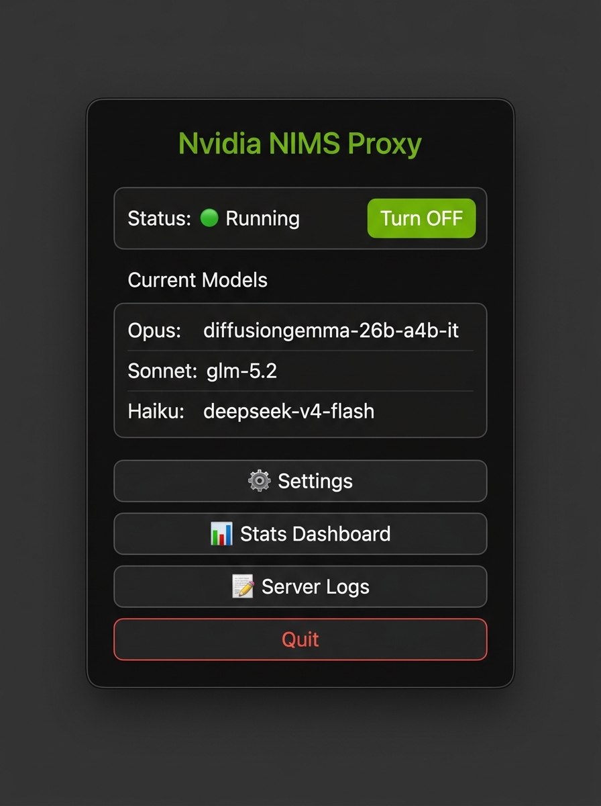
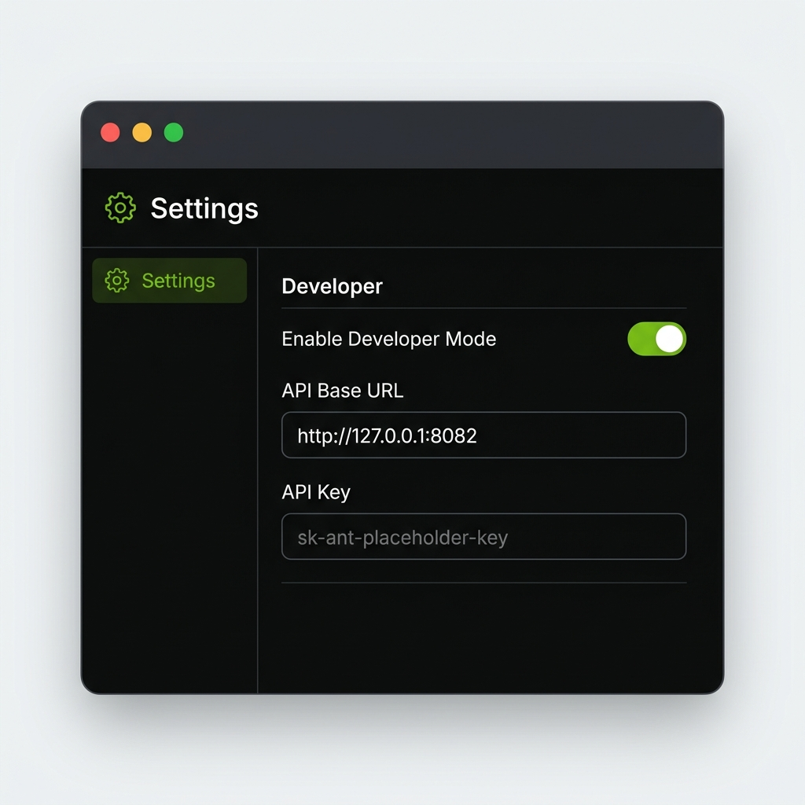

# Nvidia NIMS — macOS Client

<p align="center">
  
</p>

A premium native macOS menu bar client for managing and monitoring local **Nvidia NIMS** proxy connections. The application runs silently in the system status bar, bridging [Claude Desktop](https://claude.ai/download), [Claude Code CLI](https://docs.anthropic.com/en/docs/claude-code/overview), and VS Code to any NVIDIA NIM model endpoint via a local HTTP proxy.

---

## Features

### 🟢 Menu Bar Tray Icon
The client registers as a background agent (`LSUIElement`) in the macOS system status bar — it takes up **no dock space** and runs entirely from the menu bar. The tray icon dynamically reflects the proxy server state:

| State | Icon |
|-------|------|
| **Active** | Green Nvidia logo |
| **Stopped** | Monochrome template icon |

<p align="center">
  
</p>

### 📊 Tray Popup Menu
Clicking the tray icon opens a compact popup menu that shows the current server status, active model assignments, and provides quick-access buttons:

- **Status indicator** with a toggle to start/stop the proxy server
- **Current Models** showing which NVIDIA NIM model is mapped to each Claude slot (Opus, Sonnet, Haiku)
- **Settings** — open the full configuration window
- **Stats Dashboard** — view live request metrics
- **Server Logs** — real-time proxy log viewer
- **Quit** — gracefully shut down the proxy and exit

<p align="center">
  
</p>

### 📈 Live Stats Dashboard
A dark-mode dashboard with neon-accented styling that tracks:
- **Total Requests** handled by the proxy
- **Failed Requests** (errors, timeouts)
- **Average Latency** (moving average of response times)
- **Recent Activity Log** — real-time feed of HTTP requests with status codes and latency

<p align="center">
  
</p>

### 🔄 Automatic Model Mapping
The proxy automatically prefixes your selected NVIDIA NIM models with the required `nvidia_nim/` prefix and patches the backend's model listings on the fly. This means Claude Desktop, Claude Code, and VS Code see standard Anthropic model names (Opus, Sonnet, Haiku) while the proxy silently routes requests to the NVIDIA NIM endpoints you chose.

---

## Onboarding Tutorial

When you launch Nvidia NIMS for the first time, a guided **7-slide walkthrough** walks you through every step. Here is a detailed breakdown of the full onboarding process:

### Step 1 — Welcome & Backend Installation
The first screen welcomes you and automatically begins installing the Python backend proxy in the background. You'll see a live installation log at the bottom of the screen showing:
- Cloning the upstream proxy repository
- Installing Python dependencies via [`uv`](https://github.com/astral-sh/uv)
- Validating the environment

The **"Next"** button remains disabled and shows _"Installing Backend..."_ until the backend is fully ready. Once installation completes, you'll see a green message: _"Backend ready! You may now proceed."_

> **What happens behind the scenes:** The app runs `git clone` to download the proxy backend source, then uses `uv` to create a virtual environment and install all Python dependencies (FastAPI, uvicorn, httpx, etc.).

### Step 2 — API Key Configuration
You'll be asked to enter your **NVIDIA NIM API Key**. This is the key that authenticates all model requests through NVIDIA's inference endpoints.

**How to get your API key:**
1. Visit [build.nvidia.com](https://build.nvidia.com)
2. Sign in with your NVIDIA account (create one for free if you don't have one)
3. Navigate to **API Keys**
4. Generate a new key (it starts with `nvapi-...`)
5. Paste it into the input field

### Step 3 — Model Selection
This slide lets you browse and assign NVIDIA NIM models to each Claude slot:

1. Click **"⬇ Fetch Available Models"** — the app calls `https://integrate.api.nvidia.com/v1/models` using your API key to retrieve all available models
2. Use the **search bar** to filter models by name (e.g., type "deepseek", "qwen", "llama")
3. Click a model to select it
4. Click one of the **assign buttons** (→ Opus, → Sonnet, → Haiku, → Fallback) to map that model to the corresponding Claude slot
5. The **tag bar** at the top updates in real-time to show your current assignments

| Claude Slot | Purpose |
|------------|---------|
| **Opus** | Used when Claude Desktop/Code selects Opus 4 |
| **Sonnet** | Used when Claude Desktop/Code selects Sonnet 4 |
| **Haiku** | Used when Claude Desktop/Code selects Haiku 4 |
| **Fallback** | Used when the requested model doesn't match any slot |

### Step 4 — System Integration
Choose whether Nvidia NIMS should **start automatically on login**. If enabled, the proxy launches silently in the background every time you log into your Mac — so your local proxy is always available without manual intervention.

### Step 5 — Claude Desktop Setup (Download & Enable Developer Mode)
This slide guides you through connecting the official **Claude Desktop app** to your local proxy:

1. **Download Claude Desktop** — click the green download button, which opens [claude.ai/download](https://claude.ai/api/desktop/darwin/universal/dmg/latest/redirect?utm_source=claude_code&utm_medium=docs) in your browser
2. **Open Settings** — launch Claude Desktop, click **Claude** in the menu bar → **Settings...** (or press `⌘ ,`)
3. **Enable Developer Mode** — in the Settings window, navigate to the **Developer** tab and toggle **"Enable Developer Mode"** ON. This reveals the Gateway configuration fields

### Step 6 — Configure Gateway
With Developer Mode enabled, you now configure the proxy URL and authentication:

1. **Set the API Base URL** to:
   ```
   http://127.0.0.1:8082
   ```
   This tells Claude Desktop to send all API requests to your local NIMS proxy instead of Anthropic's servers.

2. **Set the API Key** to:
   ```
   freecc
   ```
   This is the authentication token the local proxy expects. Your actual NVIDIA API key is configured separately in the Nvidia NIMS app itself.

3. Your Claude Desktop Developer settings should look like this:

<p align="center">
  
</p>

### Step 7 — CLI & VS Code Setup + Finish
The final slide shows how to configure **Claude Code CLI** and **VS Code** to use the proxy:

**For Claude Code CLI** — add these to your `~/.zshrc`:
```bash
export ANTHROPIC_BASE_URL="http://127.0.0.1:8082"
export ANTHROPIC_AUTH_TOKEN="freecc"
```

**For VS Code** — add this to your `settings.json`:
```json
"claudeCode.environmentVariables": [
  { "name": "ANTHROPIC_BASE_URL", "value": "http://127.0.0.1:8082" },
  { "name": "ANTHROPIC_AUTH_TOKEN", "value": "freecc" }
]
```

Click **"Finish Setup"** to save your configuration, start the proxy server, and open the Stats Dashboard. The onboarding is complete!

---

## Technical Architecture

### Layout Cache Resets
macOS caches menu bar status item positions by **Bundle Identifier** and status item **GUID**. To avoid persistent "hidden icon" bugs caused by cached layout corruptions:
- The status item uses a unique GUID (`E890835D-BAA3-41E9-9C5B-1A05872A7C32`)
- The bundle identifier is set to `com.nvidia.nims.macos` to force a clean layout slot

### Local Python Backend
The client manages a local Python proxy server process:
- Spawns the backend via `uv run uvicorn server:app` on port `8082`
- Tracks stdout/stderr to parse real-time statistics
- Handles stale process termination (via `lsof` + `SIGKILL`) to prevent `EADDRINUSE` port conflicts

### Keyboard Shortcut
Press **Ctrl+Shift+N** anywhere to toggle the tray popup, even if the menu bar icon is hidden in the overflow area.

---

## Development Setup

### Prerequisites
- Node.js & npm (for Electron frontend)
- Python 3.12+ (for backend proxy)
- [uv](https://github.com/astral-sh/uv) (for Python environment management)

### Running Locally
```bash
npm install
npm run dev
```

### Packaging
```bash
# Package source into asar
npx asar pack . "/Applications/Nvidia Nims.app/Contents/Resources/app.asar"

# Re-sign the app bundle
codesign --force --deep --sign - "/Applications/Nvidia Nims.app"
```
