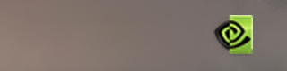
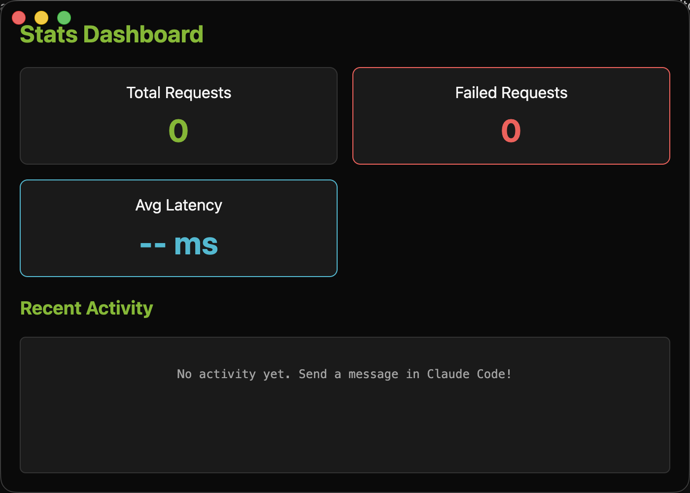

# Nvidia NIMS macOS Client

A premium native macOS status bar client for managing and monitoring local Nvidia NIMS proxy connections. The application runs silently in the menu bar and provides real-time traffic statistics, visual status indicators, and easy controls for managing local model endpoints.

## Features

### 1. macOS Menu Bar Integration
The client registers as a background agent (`LSUIElement`) in the system status bar, ensuring it takes up no dock space. It features dynamic icon indicators reflecting the proxy server's active state:
- **Green Nvidia Logo**: Proxy server is active and running.
- **Monochrome Template Icon**: Proxy server is stopped.



### 2. Live Stats Dashboard
A clean, premium dark-mode interface built with CSS gradients and neon styling that displays:
- **Total Requests**: Total count of API requests handled by the proxy.
- **Failed Requests**: Count of API errors or failed requests.
- **Average Latency**: Real-time calculated average response latency (moving average).
- **Recent Activity Log**: Real-time feed of HTTP requests, status codes, and latency metrics.



### 3. Automatic Model Mapping & Environment Configuration
The application automatically prefixes your requested Anthropic models (Opus, Sonnet, Haiku) with the required `nvidia_nim/` prefixes and patches the local backend model listings dynamically to prevent crashes and ensure compatibility with Nvidia NIM endpoints.

## Technical Architecture & Fixes

### 1. Layout Cache Resets
macOS manages menu bar status items by caching their preferred positions and visibility states based on the application's unique **Bundle Identifier** and status item **GUID**. To resolve persistent "missing icon" errors caused by cached layout corruptions (e.g. following notch collisions):
- The status item is initialized with a unique GUID to bypass GUID-level positional caches.
- The bundle identifier is updated to `com.nvidia.nims.macos` to force macOS to treat the client as a new, visible status item and assign it a clean layout slot to the left of the Focus Mode menu extra.

### 2. Local Python Backend Integration
The client manages a local python proxy server process dynamically:
- Spawns the python backend via `uv run uvicorn server:app` on port `8082`.
- Tracks process stdout/stderr to parse real-time statistics and raise alerts if specific model endpoints are missing.
- Automatically handles stale process termination (using `lsof` and `SIGKILL`) to prevent `EADDRINUSE` port conflicts on startup.

## Development Setup

### Prerequisites
- Node.js & npm (for Electron frontend)
- Python 3.12+ (for backend proxy)
- [uv](https://github.com/astral-sh/uv) (for python environment management)

### Running Locally
1. Install node dependencies:
   ```bash
   npm install
   ```
2. Start the application:
   ```bash
   npm run dev
   ```

### Packaging the App
To package the app into a production `.app` bundle:
1. Re-compile and package the source code using `asar`:
   ```bash
   npx asar pack . "/Applications/Nvidia Nims.app/Contents/Resources/app.asar"
   ```
2. Re-sign the app bundle:
   ```bash
   codesign --force --deep --sign - "/Applications/Nvidia Nims.app"
   ```
